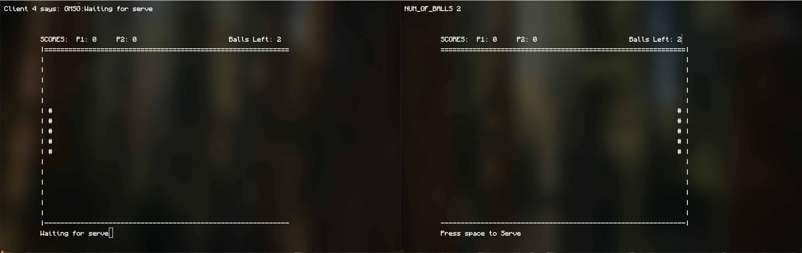
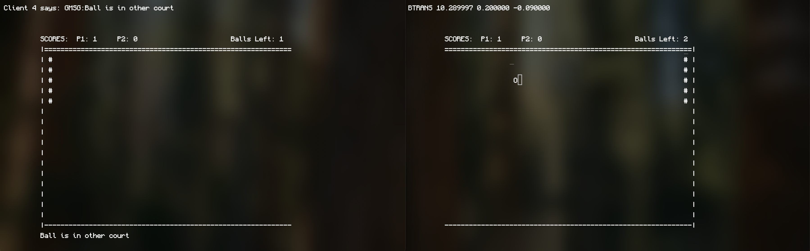
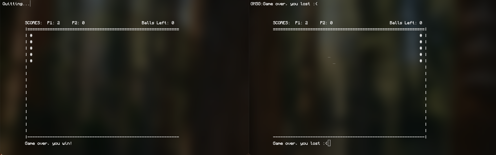

# Netpong
## About
Netpong is a simple, terminal-based Pong game designed for two players. Each player runs the program on their own machine. One player starts the game in server mode, while the other connects to the host. Once connected, both players can enjoy a classic Pong match together in semi-real time.

This project is written in C and uses standard file descriptor–based sockets for network communication. It was developed to meet the requirements of a Systems Programming course at Kent State University. Netpong is intended to run in a Unix-like environment and supports gameplay over a local network or across the internet with proper port forwarding.

## The Game

When the game starts, the connecting client is assigned the initial serve. After serving, that client controls the ball’s movement and uses their paddle to send it toward the opponent. Once the ball crosses the “net” boundary, control is transferred to the other player, and the ball is no longer displayed on the original client’s screen.


This process repeats as players return the ball back and forth, with control switching each time it crosses sides. The rally continues until one player fails to return the ball.



When a player exhausts all opportunities to return the ball, the host determines that the game has ended and calculates the final score to declare a winner. Both applications then terminate, and a new session can be started by relaunching the program.

## Compilation
The program requires a Unix Environment as it relies on ncurses to "draw" to the terminal.

To make the program, navigate to the root of this project and just type `make`

You should now be able to run `./netpong`. Send the project or the executable to another computer to play between two machines

### Usage
```
Server: ./netpong <port>
Client: ./netpong <ip_address or domain_name> <port>
```